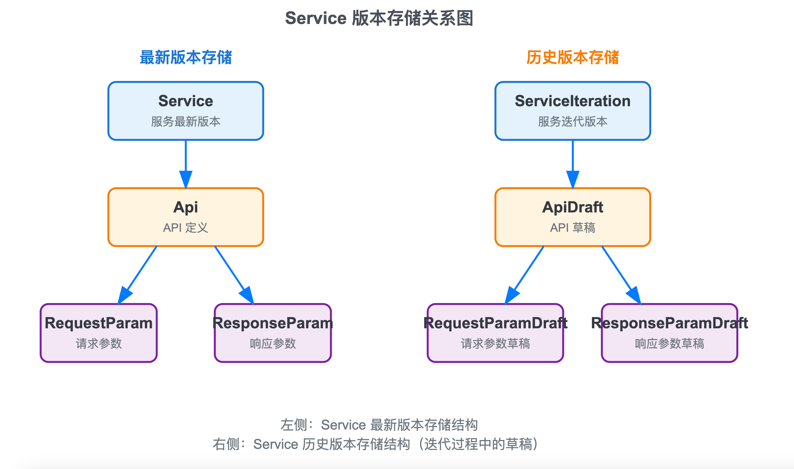

# 后端逻辑摘要

-   后端技术选型采用 `Python Robyn` 框架，数据库采用 `PostgreSQL`
-   `Python` 虚拟环境通过 `uv` 管理，项目依赖存在 `pyproject.toml` 中，首次运行项目需通过：

    ```bash
    uv sync
    ```

    安装依赖，通过：

    ```bash
    uv run ./run-dev.sh
    ```

    启动测试环境，支持热重载

-   项目默认监听 `1024` 端口，可通过修改 `.env` 中的环境变量 `PORT` 修改

-   项目环境变量配置在 `.env` 中，包含以下字段：

    ```ini
    # 项目根路径
    PYTHONPATH=<YOUR-PROJECT-PATH>

    # 项目端口
    PORT=1024

    # 数据库配置
    DATABASE_ENGINE=postgresql+psycopg2
    DATABASE_USERNAME=<YOUR-DATABASE-USERNAME>
    DATABASE_PASSWORD=<YOUR-DATABASE-PASSWORD>
    DATABASE_HOST=<YOUR-DATABASE-HOST>
    DATABASE_PORT=<YOUR-DATABASE-PORT>
    DATABASE_NAME=<YOUR-DATABASE-NAME>
    DATABASE_URI=postgresql+psycopg2://<YOUR-DATABASE-USERNAME>:<YOUR-DATABASE-PASSWORD>@<YOUR-DATABASE-HOST>:<YOUR-DATABASE-PORT>/<YOUR-DATABASE-NAME>

    # Redis 配置
    REDIS_HOST=localhost
    REDIS_PORT=6379
    REDIS_DB=0

    # 登录鉴权配置
    ALGORITHM=HS256
    LOGIN_SECRET=<YOUR-LOGIN-SECRET>
    ```

    本文件未被 `git` 管理，初次运行项目需根据实际情况填写相应环境变量。

    通过：

    ```python
    import os
    from dotenv import load_dotenv
    load_dotenv()
    VAR = os.getenv("VAR")
    ```

    获取环境变量值

## 数据库表设计

-   使用 `SQLAlchemy` 进行数据库 `ORM` 映射，全部数据库相关放到 `database` 目录中，包含：

    -   `models.py`：数据库表 `ORM` 类
    -   `enums.py`：枚举类，即自定义类型，例如 `ApiLevel`、`UserLevel` 等
    -   `database.py`：数据库连接与配置，定义 `session` 工厂
    -   `db-migrate.sh`：【见下条】

-   `database/models.py` 中数据库表修改后，只需运行：

    ```bash
    uv run database/db-migrate.sh
    ```

    进行数据库迁移（使用 `Alembic` 自动生成迁移文件并应用）

-   为方便每个表的记录的 `json` 化，让所有表继承自 `SerializableMixin` 基类，包含序列化 `toJson()` 方法，可选择保留属性、排除属性以及是否包含关系表字段；为避免循环引用，`toJson()` 实现时内部 `toJson()` 方法不得设定 `include_relations=True`。

-   `service-maintainer` 为多对多关系，通过中间表 `user_service_link` 关联

-   `ApiLevel` 枚举类从 `P0` 到 `P4` 重要性递减

-   `UserLevel` 枚举类从 `L0` 到 `L4` 权限递减。暂时只考虑 `L0` 和 `L4` 两类用户：`L0` 为超级管理员，有权限访问全部 `API`；`L4` 为普通用户，只可访问自己的 `service`、`api` 等资源。未确定中间类别的用户权限

## 服务与 API 实现

-   将全部服务分为 `user`、`service`、`api` 三类，分别对应三个子路由

-   每个路由实现内部逻辑都交由 `service` 层处理。路由层仅负责接收请求参数、调用 `service` 层方法、返回响应。`service` 层再调用对应的 `model` 层方法进行数据库的 `CRUD`

-   本项目中 `service` 层的方法规范：

    -   方法命名为 `<service_name><operation_name>`，例如 `userLogin()`、`serviceGetAllCategoriesByServiceId()` 等。避免和路由及路由函数函数重名
    -   传入 `SQLAlchemy Session` 实例，命名为 `db`，以及其他所需参数；
    -   请求成功 `200` 时，返回区分 `get` 操作与其他操作，均返回对象，对象值为：
        -   `get` 操作：单个对象或对象列表
        -   其他操作：成功 `message` 与其他必要数据
    -   请求失败 `4xx` 或 `5xx` 时，返回 `Robyn Response` 对象：

        ```python
        return Response(
            status_code=<Fail status code>,
            headers={},
            description="<Fail message>",
        )
        ```

-   **鉴权**

    -   通过 `Robyn` 内置的 `AuthenticationHandler` 实现，具体逻辑在 `authentication.py` 中
    -   登录生成 `access token` 并在后续请求 `Header` 中 `Authorization` 字段携带，格式为 `Bearer <access_token>`
    -   接口鉴权通过 `Robyn` 内置的 `BearerGetter()` 方法获取 `access token` 并进行验证；另外，在 `user` 相关 `service` 中另实现了 `userGetUserIdByAccessToken()` 方法，可传入 `Robyn Request` 或 `access token` 解析出 `user_id`。但注意：二者只能二选一传入
    -   在 `authentication.py` 中定义 `API_PERMISSION_MAP`，用于存储每个 `API` 允许访问的**最低** `UserLevel` 的映射。若 `API` 不在该 `map` 中，默认允许所有用户访问
    -   每个子路由中添加鉴权中间件

        ```python
        <subRouter>.configure_authentication(AuthHandler(token_getter=BearerGetter()))
        ```

        在每个路由中设定 `auth_required=True` 开启鉴权，即只有登录用户有权限访问

### service 相关

-   每个 `service` 有一个 `owner`，多个 `maintainer`，但计划 `MVP` 版本不引入 `maintainer`。因此除了 `L0` 用户外，只有 `owner` 才能操作其 `service`

-   每个 `service` 中包含一个唯一的 `service_uuid`，用于标识该 `service`。

    -   `service_uuid` 命名格式为 `a/b/c`，`a`、`b`、`c` 均为小写字母或数字，三者均由用户自定义
    -   `version` 命名格式为 `X.Y.Z`，其中 `X`、`Y`、`Z` 均为非负整数。所有服务初始版本均为 `1.0.0`

    **二者在前端做正则校验**

-   `api` 的 `category` 切换只支持在 `service` 最新版本中进行，不属于 `service` 迭代周期内的行为

### ⚠️ Service 版本管理

-   一次 `service` 迭代周期内包含以下几种行为：

    -   修改 `service description`
    -   新增 `API`
    -   删除 `API`
    -   编辑 `API`（包含 `API` 自有属性、请求参数以及响应参数）

-   `Service` 表存储每个 `service` 的最新版本，而 `ServiceIteration` 表存储每个 `service` 迭代周期内的所有变更。`Service` 表中的 `version` 与 `ServiceIteration` 表中当前 `service` 的最新 `version` 对齐

-   

-   `ServiceIteration` 被标记 `is_committed=False` 时，代表正在当前 `service` 的迭代周期，每个 `service` 每个用户只能有一个迭代周期在进行中；`ServiceIteration` 被标记 `is_committed=True` 时，代表该迭代周期已完成，作为当前 `service` 的历史版本记录

#### service 版本迭代流程

1. 用户发起 `service` 迭代流程 `/startIteration`，创建一个新迭代周期 `ServiceIteration` 记录，标记 `is_committed=False`，并将当前服务最新版本全部信息备份到 `ServiceIteration`，返回一个 `service_iteration_id`，存在客户端，作为本迭代周期的唯一标识

2. 用户在本迭代周期内进行上述四种行为，每次行为均在 `ServiceIteration` 中进行记录。每个行为发生需要通过 `service_iteration_id` 标识当前迭代周期：

    - 修改 `service description`：将修改后的 `description` 存储到 `ServiceIteration`
    - 新增 `API`：新增一条 `ApiDraft` 记录，只记录新增的 `API` 自有信息（`name`、`method`、`path`、`description`、`level`、`category_id`（可选））
    - 删除 `API`：通过 `api_draft_id` 删除 `ApiDraft` 记录，同时利用 `CASCADE` 删除其关联的请求参数和响应参数
    - 编辑 `API`：【⚠️ 复杂】通过 `api_draft_id` 定位到 `ApiDraft` 记录，更新其自有属性（`name`、`method`、`path`、`description`、`level`、`category_id`（可选））。之后，删除其关联的全部请求参数和响应参数，并根据传入的请求参数和响应参数，更新其关联的请求参数和响应参数。

        > 传入 `req_params` 格式约定：
        >
        > ```json
        > [
        >     {
        >         "name": "user",
        >         "location": "body",
        >         "type": "object",
        >         "required": true,
        >         "default_value": null,
        >         "description": "用户信息",
        >         "example": "{}",
        >         "array_child_type": null,
        >         "children": [
        >             {
        >                 "name": "name",
        >                 "type": "string",
        >                 "required": true,
        >                 "default_value": null,
        >                 "description": "用户姓名",
        >                 "example": "张三",
        >                 "array_child_type": null,
        >                 "children": null
        >             },
        >             {
        >                 "name": "profile",
        >                 "type": "object",
        >                 "required": false,
        >                 "default_value": null,
        >                 "description": "用户档案",
        >                 "example": "{}",
        >                 "array_child_type": null,
        >                 "children": [
        >                     {
        >                         "name": "age",
        >                         "type": "int",
        >                         "required": true,
        >                         "default_value": null,
        >                         "description": "年龄",
        >                         "example": "25",
        >                         "array_child_type": null,
        >                         "children": null
        >                     }
        >                 ]
        >             }
        >         ]
        >     },
        >     {
        >         "name": "tags",
        >         "location": "query",
        >         "type": "array",
        >         "required": false,
        >         "default_value": null,
        >         "description": "标签列表",
        >         "example": "[\"tag1\", \"tag2\"]",
        >         "array_child_type": "string",
        >         "children": null
        >     }
        > ]
        > ```
        >
        > `resp_params` 类似，只是 `location` 换为 `status_code`

3. 用户在本迭代周期内完成所有行为后，发起提交 `/commitIteration`，将 `ServiceIteration` 其全部信息拷贝进 `Service` 表中（即全部关联的 `ApiDraft`，及其中记录的全部请求参数和响应参数），同步到数据库中的 `Api`、`RequestParam` 和 `ResponseParam` 表中。之后更新当前 `service` 的 `version`，并将 `ServiceIteration` 标记 `is_committed=True`。保留 `ServiceIteration` 记录，作为历史版本记录
